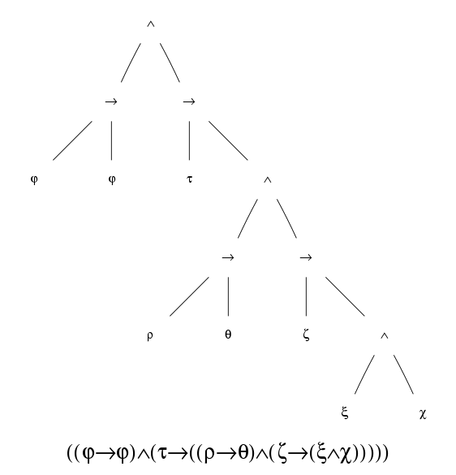
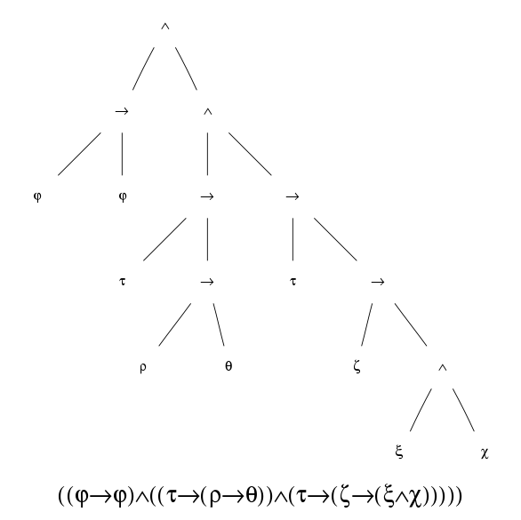

# A Prolog isomorphism checker for Intersection Types

A type-expression reducer and isomorphism checker complete with Graphviz image generation of various stages of term's reduction. A working implementation can be found and tried at: [http://lambda.di.unito.it/iso/](http://lambda.di.unito.it/iso/).  
Depends on [Graphviz](http://www.graphviz.org/) to generate the expression tree for before:

and after:

the reduction.
